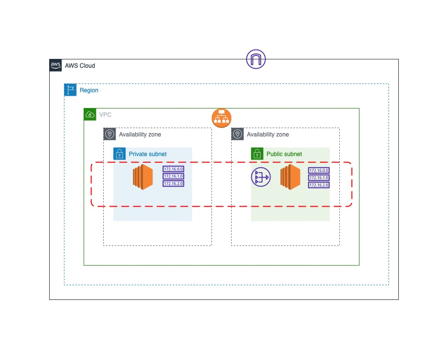

# Cloud Engineering Challenge

## Diagram




## What is this?
A minimalistic production-ready environmnet in Terraform for running a rudimentary web-application that returns a "Hello Graylog!" string upon a GET https request.

## What is Terraform?
[Terraform](https://www.terraform.io) is an infrastructure as a code tool that helps manage our cloud resources.

## How to install and run this?
If you plan on using this in your environmnet, you need to follow these steps: 
1. Install terraform using these steps [here](https://learn.hashicorp.com/tutorials/terraform/install-cli)
2. Clone this repository if you haven't already
3. Configure your AWS user by running ```aws configure``` in CLI
4. Follow the Terraform workflow: ```terraform init```, ```terraform validate```, ```terraform plan```, ```terraform apply``` 


## Credit
1. [Terraform documentation](https://www.terraform.io/docs)

## License

[MIT License](https://github.com/Tobiajet/Cloud-Challenge/blob/main/LICENSE)
